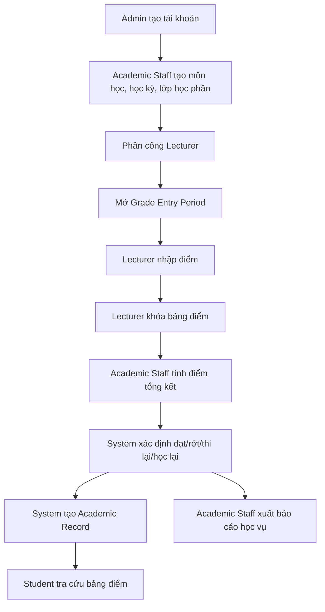

# Chủ đề và phạm vi dự án

## 1. Tên đề tài

**Hệ thống Quản lý Kết quả Học tập**

## 2. Mô tả tổng quan

Hệ thống được xây dựng để quản lý kết quả học tập của sinh viên theo hướng tập trung, rõ ràng và dễ tra cứu. Trọng tâm của dự án là xử lý điểm số: nhập điểm thành phần, tính điểm tổng kết, xếp loại học lực, xử lý học lại/thi lại và hiển thị bảng điểm cho sinh viên.

Dữ liệu đầu vào quan trọng nhất là **mã sinh viên**. Hệ thống không đi sâu vào lý lịch chi tiết của sinh viên, vì mục tiêu chính là quản lý kết quả học tập thay vì quản lý hồ sơ cá nhân.

## 3. Mục tiêu dự án

- Giảm sai sót khi nhập điểm và tính điểm thủ công.
- Chuẩn hóa cách tính điểm tổng kết theo từng môn học.
- Chuẩn hóa quy trình xếp loại học lực.
- Tự động xác định trạng thái môn học: đạt, không đạt, thi lại, học lại.
- Hỗ trợ sinh viên tra cứu kết quả nhanh chóng.
- Hỗ trợ giảng viên nhập điểm và khóa bảng điểm.
- Hỗ trợ giáo vụ quản lý đợt nhập điểm, tổng kết điểm và xuất báo cáo.
- Hỗ trợ quản trị viên quản lý tài khoản, phân quyền và nhật ký hệ thống.

## 3.1 Phân chia role nhóm phát triển

| Thành viên | Role chính | Phạm vi chịu trách nhiệm |
| --- | --- | --- |
| Thành viên 1 | **Frontend** | Giao diện React, route, form, validate phía client, gọi API, responsive UI, xử lý trạng thái đăng nhập trên client |
| Thành viên 2 | **Backend + QA + Document Lead** | API Node.js/Express, authentication/authorization, business logic, kiểm thử API/chức năng, viết README/tài liệu, tổng hợp checklist nộp |
| Thành viên 3 | **Database + DevOps** | ERD, schema MySQL, seed/migration, kết nối database, Docker/.env, deploy frontend/backend/database, cấu hình production |

Ba role này là vai trò của nhóm phát triển, khác với vai trò người dùng hệ thống như Student, Lecturer, Academic Staff và Admin.

## 4. Phạm vi trong hệ thống

### 4.1 In Scope

| Nhóm | Nội dung |
| --- | --- |
| Quản lý tài khoản | Đăng nhập, phân quyền, khóa/mở tài khoản |
| Quản lý sinh viên | Lưu mã sinh viên, họ tên, lớp, trạng thái học tập cơ bản |
| Quản lý môn học | Mã môn, tên môn, số tín chỉ, quy tắc điểm |
| Quản lý lớp học phần | Lớp học phần, học kỳ, giảng viên phụ trách |
| Nhập điểm | Nhập điểm chuyên cần, bài tập, giữa kỳ, cuối kỳ |
| Tính điểm | Tự động tính điểm tổng kết theo trọng số |
| Xếp loại học lực | Tính điểm trung bình học kỳ và xếp loại |
| Xử lý học vụ | Lập danh sách sinh viên thi lại/học lại |
| Tra cứu | Sinh viên xem bảng điểm và trạng thái môn học |
| Báo cáo | Xuất bảng điểm, danh sách thi lại/học lại |
| Audit log | Ghi lại thao tác nhạy cảm như sửa điểm, khóa tài khoản |

### 4.2 Out of Scope

| Nội dung không làm | Lý do |
| --- | --- |
| Quản lý học phí | Không thuộc phạm vi xử lý kết quả học tập |
| Quản lý khen thưởng/kỷ luật | Không phải nghiệp vụ chính của đề tài |
| Quản lý đăng ký môn học đầy đủ | Có thể giả lập dữ liệu lớp học phần và enrollment |
| Quản lý lý lịch sinh viên chi tiết | Hệ thống chỉ cần mã sinh viên và thông tin hiển thị tối thiểu |
| Cổng thanh toán | Không liên quan đến nhập điểm/tính điểm |

## 5. Actor chính

| Actor | Vai trò |
| --- | --- |
| Student | Tra cứu bảng điểm, xem học lực, xem thông báo thi lại/học lại |
| Lecturer | Nhập điểm, sửa điểm trong thời gian cho phép, khóa bảng điểm |
| Academic Staff | Mở/đóng đợt nhập điểm, tính điểm tổng kết, xếp loại, lập danh sách học vụ |
| Admin | Quản lý tài khoản, phân quyền, xem nhật ký hệ thống, cấu hình tham số |

## 6. Danh sách chức năng chính

| Mã | Chức năng | Actor chính | Độ ưu tiên |
| --- | --- | --- | --- |
| F-01 | Đăng nhập hệ thống | Tất cả người dùng | Must |
| F-02 | Quản lý tài khoản người dùng | Admin | Must |
| F-03 | Quản lý sinh viên cơ bản | Admin/Academic Staff | Must |
| F-04 | Quản lý môn học | Academic Staff | Must |
| F-05 | Quản lý lớp học phần | Academic Staff | Must |
| F-06 | Phân công giảng viên cho lớp học phần | Academic Staff | Should |
| F-07 | Mở/đóng đợt nhập điểm | Academic Staff | Must |
| F-08 | Nhập điểm thành phần | Lecturer | Must |
| F-09 | Sửa điểm trong thời gian cho phép | Lecturer | Must |
| F-10 | Khóa bảng điểm | Lecturer | Must |
| F-11 | Tính điểm tổng kết | Academic Staff/System | Must |
| F-12 | Xếp loại học lực | Academic Staff/System | Must |
| F-13 | Xác định thi lại/học lại | Academic Staff/System | Must |
| F-14 | Nhập điểm thi lại/học lại | Lecturer/Academic Staff | Should |
| F-15 | Tra cứu bảng điểm | Student | Must |
| F-16 | Xuất báo cáo | Academic Staff | Should |
| F-17 | Ghi nhật ký sửa điểm | System | Must |
| F-18 | Tra cứu audit log | Admin | Should |

## 7. Yêu cầu phi chức năng

| Mã | Nhóm | Nội dung |
| --- | --- | --- |
| NFR-01 | Performance | Thao tác tra cứu và lưu điểm phản hồi trong khoảng 2 giây ở điều kiện bình thường |
| NFR-02 | Security | Mật khẩu phải được băm bằng bcrypt, không lưu plain text |
| NFR-03 | Security | API quan trọng yêu cầu JWT và phân quyền theo role |
| NFR-04 | Security | Chặn nhập điểm trái quyền hoặc ngoài thời gian mở cổng |
| NFR-05 | Reliability | Ghi audit log khi sửa điểm, khóa bảng điểm, khóa tài khoản |
| NFR-06 | Usability | Giao diện nhập điểm và tra cứu điểm rõ ràng, dễ thao tác |
| NFR-07 | Maintainability | Code tách Controller, Service, Repository, Model |
| NFR-08 | Deployability | Có hướng dẫn `.env`, database, build và deploy rõ ràng |

## 8. Thực thể chính

| Entity | Bảng database | Mục đích |
| --- | --- | --- |
| User | `users` | Tài khoản đăng nhập và phân quyền |
| Student | `students` | Định danh sinh viên |
| Lecturer | `lecturers` | Định danh giảng viên |
| Course | `courses` | Môn học |
| Semester | `semesters` | Học kỳ/năm học |
| ClassSection | `class_sections` | Lớp học phần |
| Enrollment | `enrollments` | Sinh viên tham gia lớp học phần |
| Grade | `grades` | Điểm thành phần và điểm tổng kết |
| GradeRule | `grade_rules` | Trọng số điểm và ngưỡng đạt/rớt |
| GradeEntryPeriod | `grade_entry_periods` | Đợt mở/đóng cổng nhập điểm |
| RetakeResult | `retake_results` | Kết quả thi lại/học lại |
| AcademicRecord | `academic_records` | Tổng kết học kỳ và xếp loại |
| AuditLog | `audit_logs` | Nhật ký thao tác hệ thống |

## 9. Luồng nghiệp vụ tổng quát

