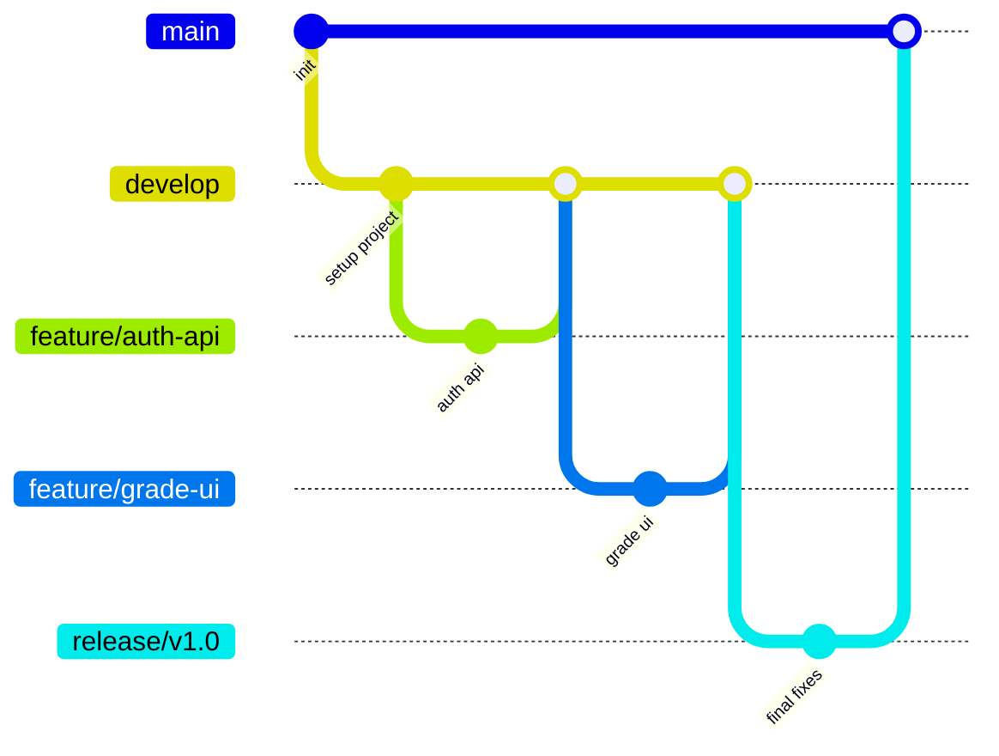

# Quy trình Git, Branch, Commit và Pull Request

## 1. Mục tiêu

File này quy định cách nhóm 3 thành viên làm việc trên GitHub để tránh mất code, trùng việc, conflict và khó theo dõi tiến độ.


## 1.1 Phân chia 3 role khi dùng Git

| Thành viên | Role chính | Phạm vi chịu trách nhiệm |
| --- | --- | --- |
| Thành viên 1 | **Frontend** | Giao diện React, route, form, validate phía client, gọi API, responsive UI, xử lý trạng thái đăng nhập trên client |
| Thành viên 2 | **Backend + QA + Document Lead** | API Node.js/Express, authentication/authorization, business logic, kiểm thử API/chức năng, viết README/tài liệu, tổng hợp checklist nộp |
| Thành viên 3 | **Database + DevOps** | ERD, schema MySQL, seed/migration, kết nối database, Docker/.env, deploy frontend/backend/database, cấu hình production |

Mỗi role nên làm trên branch riêng, tạo Pull Request vào `develop` và không push trực tiếp vào `main`.

## 2. Mô hình branch đề xuất



## 3. Ý nghĩa từng branch

| Branch | Mục đích | Ai được merge |
| --- | --- | --- |
| `main` | Code ổn định cuối cùng để nộp/demo | Nhóm trưởng hoặc người phụ trách Git |
| `develop` | Code đang tích hợp của cả nhóm | Cả nhóm thông qua Pull Request |
| `feature/*` | Làm chức năng mới | Thành viên phụ trách chức năng |
| `fix/*` | Sửa lỗi | Người được giao sửa lỗi |
| `docs/*` | Sửa tài liệu | Người phụ trách tài liệu |
| `release/*` | Chuẩn bị bản nộp cuối | Nhóm trưởng hoặc DevOps |
| `hotfix/*` | Sửa lỗi gấp trên `main` | Nhóm trưởng hoặc người được giao |

## 4. Quy ước đặt tên branch

### 4.1 Feature branch

```bash
feature/<module>-<short-description>
```

Ví dụ:

```bash
feature/auth-login-api
feature/grade-input-page
feature/student-transcript
feature/admin-user-management
feature/academic-classification
```

### 4.2 Fix branch

```bash
fix/<bug-short-description>
```

Ví dụ:

```bash
fix/grade-validation-error
fix/login-token-expired
fix/cors-production-domain
```

### 4.3 Docs branch

```bash
docs/<document-name>
```

Ví dụ:

```bash
docs/update-readme
docs/api-spec
docs/deployment-guide
```

## 5. Quy ước commit message

Dùng format:

```bash
<type>(<scope>): <short description>
```

Trong đó:

| Type | Ý nghĩa | Ví dụ |
| --- | --- | --- |
| `feat` | Thêm chức năng mới | `feat(auth): add login api` |
| `fix` | Sửa lỗi | `fix(grade): validate score range` |
| `docs` | Sửa tài liệu | `docs(readme): add local setup guide` |
| `style` | Sửa format, không đổi logic | `style(frontend): format grade table` |
| `refactor` | Cải tổ code, không đổi hành vi | `refactor(service): split grade calculation` |
| `test` | Thêm/sửa test | `test(auth): add login test cases` |
| `chore` | Công việc cấu hình nhỏ | `chore: update gitignore` |
| `build` | Build/dependency | `build: add sequelize dependency` |
| `ci` | CI/CD | `ci: add github action for backend test` |

## 6. Ví dụ commit tốt

```bash
git commit -m "feat(auth): implement jwt login api"
git commit -m "feat(grade): add bulk grade input endpoint"
git commit -m "fix(grade): reject score greater than 10"
git commit -m "docs(deploy): add render deployment steps"
git commit -m "refactor(db): move queries to repositories"
```

## 7. Ví dụ commit không nên dùng

```bash
git commit -m "update"
git commit -m "fix"
git commit -m "code lai"
git commit -m "abc"
git commit -m "sua linh tinh"
```

Lý do không nên dùng: không biết sửa gì, khó tra lịch sử, khó viết báo cáo tiến độ.

## 8. Quy trình làm việc hằng ngày

### 8.1 Trước khi code

```bash
git checkout develop
git pull origin develop
git checkout -b feature/grade-input-api
```

### 8.2 Trong khi code

Kiểm tra file đã sửa:

```bash
git status
```

Xem thay đổi:

```bash
git diff
```

Commit theo từng phần hợp lý:

```bash
git add backend/src/controllers/grade.controller.js
git add backend/src/services/grade.service.js
git commit -m "feat(grade): add grade input controller and service"
```

### 8.3 Push branch

```bash
git push origin feature/grade-input-api
```

### 8.4 Tạo Pull Request

Tạo PR từ:

```text
feature/grade-input-api -> develop
```

Nội dung PR nên có:

```md
## Mô tả
- Thêm API nhập điểm hàng loạt.
- Kiểm tra điểm từ 0 đến 10.
- Ghi audit log khi sửa điểm.

## Cách test
1. Đăng nhập bằng tài khoản Lecturer.
2. Gọi POST /api/v1/grades/bulk.
3. Kiểm tra bảng grades và audit_logs.

## Checklist
- [ ] Code chạy local.
- [ ] Không push .env.
- [ ] Không lỗi lint cơ bản.
- [ ] Đã test bằng Postman.
```

## 9. Quy tắc Pull Request

| Quy tắc | Mô tả |
| --- | --- |
| Không merge code của mình khi chưa ai review | Ít nhất 1 thành viên khác xem qua |
| PR nhỏ, rõ ràng | Mỗi PR nên tập trung vào 1 chức năng |
| Không đưa file thừa | Không push `node_modules`, `.env`, `dist`, `build` |
| Mô tả cách test | Người review biết kiểm tra như thế nào |
| Pull `develop` mới nhất trước khi merge | Giảm conflict |

## 10. Quy trình xử lý conflict

Khi đang ở branch feature:

```bash
git checkout feature/grade-input-api
git fetch origin
git merge origin/develop
```

Nếu có conflict:

1. Mở file bị conflict.
2. Tìm đoạn:

```text
<<<<<<< HEAD
code của mình
=======
code từ develop
>>>>>>> origin/develop
```

3. Giữ phần code đúng, xóa marker conflict.
4. Chạy lại project/test.
5. Commit conflict fix:

```bash
git add .
git commit -m "fix: resolve merge conflict with develop"
git push origin feature/grade-input-api
```

## 11. Quy trình release cuối

### 11.1 Tạo release branch

```bash
git checkout develop
git pull origin develop
git checkout -b release/v1.0
git push origin release/v1.0
```

### 11.2 Test và sửa lỗi nhỏ

Chỉ sửa lỗi nhỏ, không thêm chức năng lớn ở release branch.

```bash
git commit -m "fix(release): update env example and readme"
```

### 11.3 Merge vào main

```bash
git checkout main
git pull origin main
git merge release/v1.0
git push origin main
```

### 11.4 Tạo tag

```bash
git tag -a v1.0-final -m "Final submission"
git push origin v1.0-final
```

## 12. Phân chia branch theo 3 role

| Role | Branch chính nên làm | Nội dung |
| --- | --- | --- |
| Frontend | `feature/frontend-login`, `feature/frontend-dashboard`, `feature/frontend-grade-input`, `feature/frontend-transcript`, `feature/frontend-admin` | Giao diện, route, form, validate phía client, gọi API bằng Axios |
| Backend + QA + Document Lead | `feature/backend-auth`, `feature/backend-grade-api`, `feature/backend-academic-api`, `feature/backend-admin-audit`, `docs/api-spec`, `test/api-checklist` | API, service, middleware phân quyền, kiểm thử API/chức năng, README/tài liệu |
| Database + DevOps | `feature/database-schema`, `feature/database-seed`, `chore/docker-env`, `feature/deployment-config`, `release/v1.0` | ERD/schema/seed, database connection, Docker, `.env`, deploy, release/tag |

### 12.1 Quy tắc review theo role

| PR thuộc phần | Người code chính | Người nên review |
| --- | --- | --- |
| Frontend UI | Frontend | Backend + QA + Document Lead kiểm tra luồng; Database + DevOps kiểm tra biến môi trường |
| Backend API | Backend + QA + Document Lead | Frontend kiểm tra response có dễ dùng không; Database + DevOps kiểm tra query/schema |
| Database/DevOps | Database + DevOps | Backend + QA + Document Lead kiểm tra API còn chạy; Frontend kiểm tra production URL |
| Docs/Test | Backend + QA + Document Lead | Cả nhóm xem lại trước khi nộp |

## 13. `.gitignore` đề xuất

```gitignore
# dependencies
node_modules/

# environment
.env
.env.local
.env.production

# build output
dist/
build/
coverage/

# logs
logs/
*.log
npm-debug.log*

# OS/IDE
.DS_Store
Thumbs.db
.vscode/
.idea/

# database backup
*.sql.gz
*.dump

# uploads
uploads/
```

## 14. Checklist trước khi commit

- [ ] Code chạy được ở local.
- [ ] Không có `.env` trong commit.
- [ ] Không có `console.log` debug thừa ở production code.
- [ ] Không hard-code mật khẩu/database URL.
- [ ] Tên file, tên biến rõ ràng.
- [ ] Commit message đúng quy ước.
- [ ] Nếu sửa API, đã cập nhật tài liệu API.
- [ ] Nếu sửa database, đã cập nhật schema/migration.

