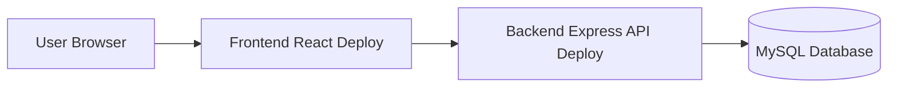

# Hướng dẫn Deploy dự án

## 1. Mục tiêu

File này hướng dẫn deploy hệ thống **Quản lý Kết quả Học tập** gồm 3 phần:

1. Database MySQL.
2. Backend Node.js/Express.
3. Frontend ReactJS.

Mục tiêu cuối cùng là có link demo để giảng viên có thể truy cập và kiểm tra chức năng.

## 2. Mô hình deploy đề xuất



## 3. Các lựa chọn deploy

| Thành phần | Lựa chọn dễ dùng | Ghi chú |
| --- | --- | --- |
| Database | Railway MySQL, PlanetScale, Aiven, VPS MySQL | Nên dùng cloud DB để backend truy cập được |
| Backend | Render Web Service, Railway, VPS | Cần cấu hình biến môi trường |
| Frontend | Vercel, Netlify, Render Static Site | Cần cấu hình API URL production |

## 4. Chuẩn bị trước khi deploy

### 4.1 Checklist code

- [ ] Backend chạy local không lỗi.
- [ ] Frontend chạy local không lỗi.
- [ ] Database import được `schema.sql` và `seed.sql`.
- [ ] `.env.example` đầy đủ.
- [ ] Không push `.env` thật lên GitHub.
- [ ] CORS đã cấu hình theo domain frontend.
- [ ] API dùng biến môi trường, không hard-code localhost.

### 4.2 Kiểm tra GitHub

```bash
git status
git checkout develop
git pull origin develop
npm test
```

Nếu ổn, merge vào release:

```bash
git checkout -b release/v1.0
git push origin release/v1.0
```

## 5. Deploy Database MySQL

### 5.1 Tạo database cloud

Tạo một MySQL instance trên Railway/Aiven/VPS. Sau khi tạo xong, lấy các thông tin:

```env
DB_HOST=<production-db-host>
DB_PORT=3306
DB_NAME=<production-db-name>
DB_USER=<production-db-user>
DB_PASSWORD=<production-db-password>
```

### 5.2 Import schema

Nếu cloud provider cho terminal hoặc connection string, import bằng:

```bash
mysql -h <DB_HOST> -P <DB_PORT> -u <DB_USER> -p <DB_NAME> < database/schema.sql
mysql -h <DB_HOST> -P <DB_PORT> -u <DB_USER> -p <DB_NAME> < database/seed.sql
```

### 5.3 Kiểm tra bảng

```sql
SHOW TABLES;
SELECT COUNT(*) FROM users;
SELECT COUNT(*) FROM students;
```

## 6. Deploy Backend trên Render

### 6.1 Chuẩn bị backend

Trong `backend/package.json` nên có:

```json
{
  "scripts": {
    "start": "node src/server.js",
    "dev": "nodemon src/server.js"
  }
}
```

Backend cần lắng nghe cổng từ biến môi trường:

```js
const PORT = process.env.PORT || 5000;
app.listen(PORT, () => console.log(`Server running on ${PORT}`));
```

### 6.2 Tạo Web Service trên Render

1. Vào Render.
2. Chọn **New Web Service**.
3. Kết nối GitHub repository.
4. Chọn root directory là `backend` nếu repo có cả frontend/backend.
5. Build command:

```bash
npm install
```

6. Start command:

```bash
npm start
```

### 6.3 Cấu hình Environment Variables

| Biến | Ví dụ |
| --- | --- |
| `NODE_ENV` | `production` |
| `PORT` | Render tự cấp, có thể không cần đặt |
| `DB_HOST` | Host database production |
| `DB_PORT` | `3306` |
| `DB_NAME` | Tên database production |
| `DB_USER` | User database |
| `DB_PASSWORD` | Password database |
| `JWT_SECRET` | Chuỗi bí mật dài |
| `JWT_EXPIRES_IN` | `1d` |
| `CORS_ORIGIN` | Domain frontend production |

### 6.4 Kiểm tra backend sau deploy

Tạo endpoint health check:

```js
app.get('/health', (req, res) => {
  res.json({ status: 'ok', service: 'academic-result-api' });
});
```

Truy cập:

```text
https://<backend-domain>/health
```

Kết quả mong muốn:

```json
{
  "status": "ok",
  "service": "academic-result-api"
}
```

## 7. Deploy Frontend trên Vercel

### 7.1 Chuẩn bị frontend

Trong `frontend/package.json`:

```json
{
  "scripts": {
    "dev": "vite",
    "build": "vite build",
    "preview": "vite preview"
  }
}
```

### 7.2 Cấu hình API URL

Tạo `frontend/.env.example`:

```env
VITE_API_BASE_URL=http://localhost:5000/api/v1
```

Trên Vercel đặt biến môi trường:

```env
VITE_API_BASE_URL=https://<backend-domain>/api/v1
```

### 7.3 Tạo Project trên Vercel

1. Vào Vercel.
2. Import GitHub repository.
3. Chọn root directory là `frontend`.
4. Build command:

```bash
npm run build
```

5. Output directory:

```bash
dist
```

6. Thêm biến môi trường `VITE_API_BASE_URL`.
7. Deploy.

## 8. Cấu hình CORS backend

Cài `cors`:

```bash
cd backend
npm install cors
```

Trong `app.js`:

```js
const cors = require('cors');

app.use(cors({
  origin: process.env.CORS_ORIGIN,
  credentials: true,
}));
```

Nếu cần cho nhiều domain:

```js
const allowedOrigins = process.env.CORS_ORIGIN.split(',');

app.use(cors({
  origin: function (origin, callback) {
    if (!origin || allowedOrigins.includes(origin)) {
      callback(null, true);
    } else {
      callback(new Error('Not allowed by CORS'));
    }
  },
  credentials: true,
}));
```

## 9. Deploy bằng Docker Compose trên VPS

Nếu dùng VPS, có thể tạo `docker-compose.yml`:

```yaml
version: '3.8'

services:
  mysql:
    image: mysql:8.0
    container_name: academic_mysql
    restart: always
    environment:
      MYSQL_ROOT_PASSWORD: root_password
      MYSQL_DATABASE: academic_result_management
      MYSQL_USER: academic_app
      MYSQL_PASSWORD: StrongPassword123!
    ports:
      - "3306:3306"
    volumes:
      - mysql_data:/var/lib/mysql
      - ./database/schema.sql:/docker-entrypoint-initdb.d/01_schema.sql
      - ./database/seed.sql:/docker-entrypoint-initdb.d/02_seed.sql

  backend:
    build: ./backend
    container_name: academic_backend
    restart: always
    ports:
      - "5000:5000"
    environment:
      NODE_ENV: production
      PORT: 5000
      DB_HOST: mysql
      DB_PORT: 3306
      DB_NAME: academic_result_management
      DB_USER: academic_app
      DB_PASSWORD: StrongPassword123!
      JWT_SECRET: replace_this_secret
      CORS_ORIGIN: http://localhost:3000
    depends_on:
      - mysql

  frontend:
    build: ./frontend
    container_name: academic_frontend
    restart: always
    ports:
      - "3000:80"
    depends_on:
      - backend

volumes:
  mysql_data:
```

Chạy:

```bash
docker compose up -d --build
```

Kiểm tra:

```bash
docker compose ps
docker compose logs backend
```

## 10. Checklist sau deploy

| Mục cần kiểm tra | Cách kiểm tra | Kết quả mong muốn |
| --- | --- | --- |
| Backend sống | Mở `/health` | Trả `{ status: 'ok' }` |
| Database kết nối | Xem log backend | Không có lỗi connection |
| Frontend mở được | Mở domain frontend | Hiển thị LoginPage |
| Login hoạt động | Đăng nhập tài khoản seed | Vào được dashboard |
| API không bị CORS | Mở DevTools Console | Không có lỗi CORS |
| Student xem điểm | Đăng nhập role Student | Hiển thị bảng điểm |
| Lecturer nhập điểm | Đăng nhập role Lecturer | Lưu điểm thành công |
| Admin xem log | Đăng nhập role Admin | Thấy audit logs |

## 11. Lỗi thường gặp khi deploy

### 11.1 Lỗi CORS

Triệu chứng:

```text
Access to XMLHttpRequest has been blocked by CORS policy
```

Cách sửa:

- Kiểm tra `CORS_ORIGIN` ở backend.
- Đảm bảo domain frontend đúng, không thừa dấu `/` cuối.
- Redeploy backend sau khi đổi biến môi trường.

### 11.2 Backend không kết nối được MySQL

Triệu chứng:

```text
ECONNREFUSED
Access denied for user
Unknown database
```

Cách sửa:

- Kiểm tra `DB_HOST`, `DB_PORT`, `DB_USER`, `DB_PASSWORD`, `DB_NAME`.
- Kiểm tra database cloud có cho phép external connection không.
- Kiểm tra IP whitelist nếu provider yêu cầu.

### 11.3 Frontend vẫn gọi localhost

Triệu chứng:

```text
GET http://localhost:5000/api/v1/... failed
```

Cách sửa:

- Kiểm tra `VITE_API_BASE_URL` trên Vercel/Netlify.
- Build lại frontend sau khi đổi env.
- Trong code không hard-code `localhost`.

### 11.4 JWT_SECRET bị thiếu

Triệu chứng:

```text
secretOrPrivateKey must have a value
```

Cách sửa:

- Thêm biến `JWT_SECRET` ở môi trường production.
- Redeploy backend.

## 12. Checklist nộp bài

- [ ] Có link GitHub repository.
- [ ] Có link frontend demo.
- [ ] Có link backend health check/API.
- [ ] README có hướng dẫn chạy local.
- [ ] README có tài khoản demo.
- [ ] Database schema/seed nằm trong repo.
- [ ] Không có `.env` thật trên GitHub.
- [ ] Có ảnh hoặc video demo nếu giảng viên yêu cầu.
- [ ] Có tag release cuối.

